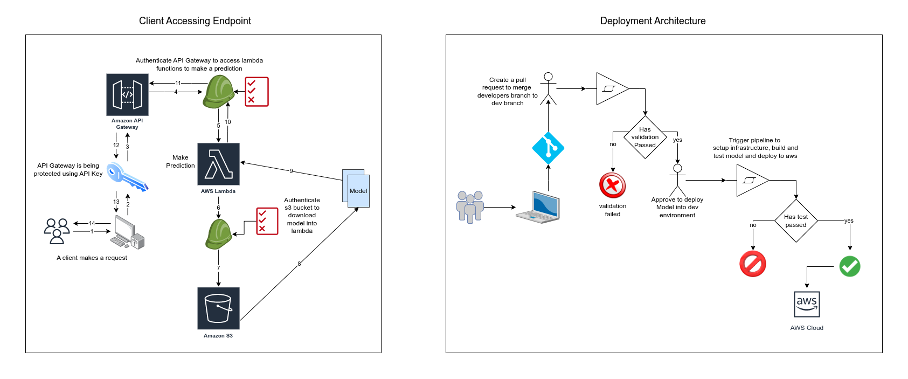
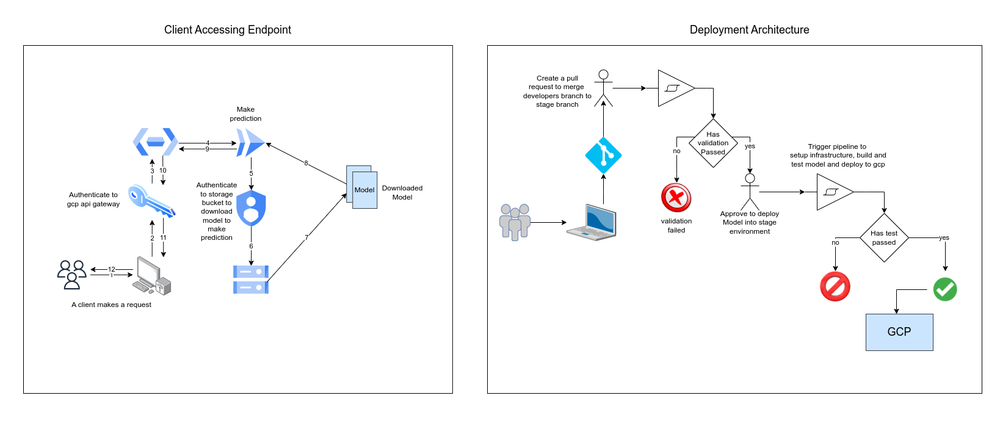
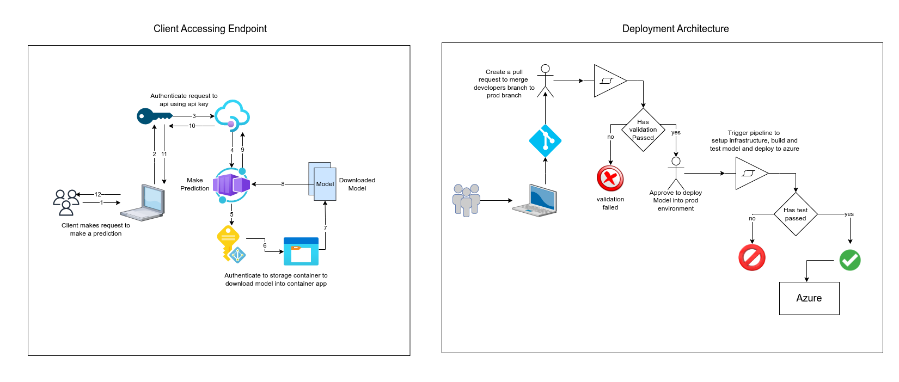

# Title
Fraud Insurance Claim Prediction

## Problem Statements

## Cloud Architecture Diagrams
After the model as built, development environment was deployed onto AWS, staging environment on GCP and Production environment on Azure.

### Dev Environment On AWS Architecture Diagram
* A user makes a request to make prediction
* The request get routed to aws apigateway which get authorized to confirm if user has permission to access endpoint.
* API gateway sends the request to aws lambda function to make a prediction.
* AWS lambda function access s3 bucket to download model make prediction and send predicted output to client.

### Staging Environment On GCP Architecture Diagram
* A user makes a request to make prediction
* The request get routed to gcp apigateway which get authorized to confirm if user has permission to access endpoint.
* API gateway sends the request to gcp cloudrun to make a prediction.
* GCP cloudrun access storage bucket to download model, make prediction and send predicted output to client.

### Prod Environment On Azure Architecture Diagram
* A user makes a request to make prediction
* The request get routed to azure apimanager which get authorized to confirm if user has permission to access endpoint.
* API manager sends the request to azure containerapp to make prediction.
* Azure containerapp access storage account to download model, make prediction and send predicted output to client.

